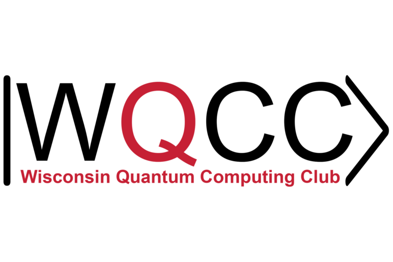

# ⚡WQCC-Intro-to-Qiskit⚡

## Qiskit 101 tutorial -  WQCC x IBM Qiskit Fall Fest 2023  
- WQCC presents UW-Madison’s first ever Qiskit Fall Fest with IBM Quantum for an exciting quantum computing journey. Whether you’re a beginner or expert, you’ll enjoy tutorials, challenges, and hackathons. Earn an IBM certificate, win swag, and network with quantum leaders. **No experience required.**
- Objective of this tutorial is to teach a wide variety of Qiskit techniques - before the particpiants attempt the IBM Qiskit Fall Fest challenge notebooks  
- Short tutorial developed and led by Dhanvi Bharadwaj (Quantum Software lead at <a href = "https://wqi.wisc.edu/wqcc/">WQCC</a>) 

